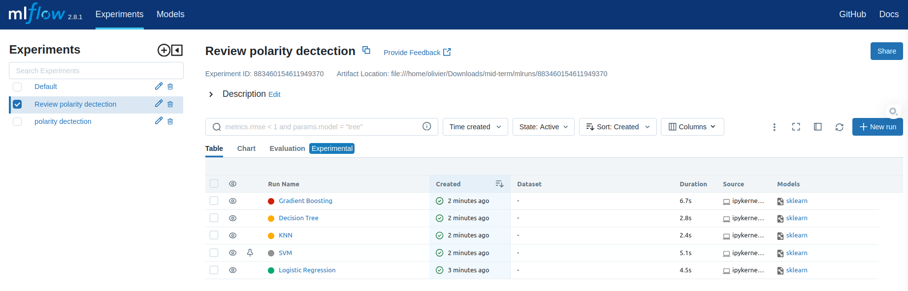
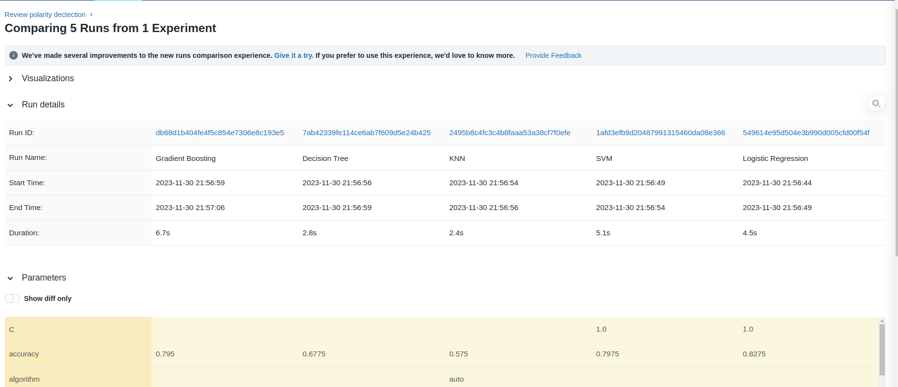
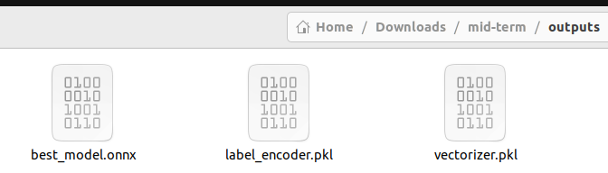
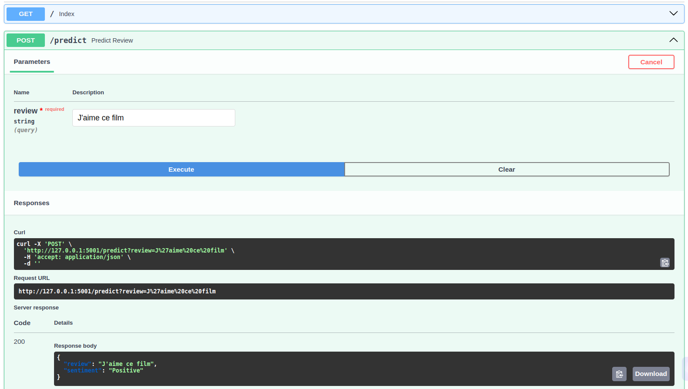
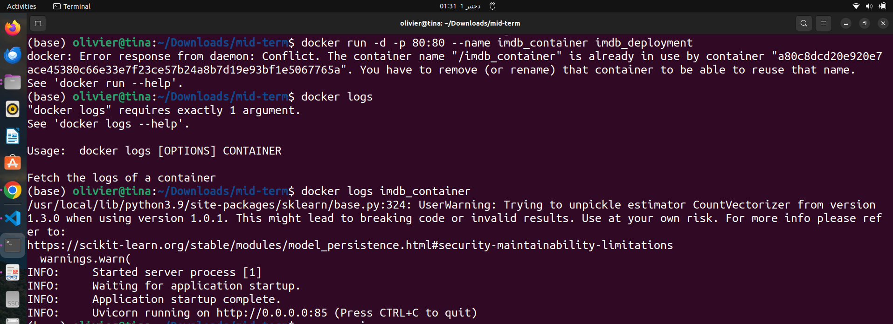
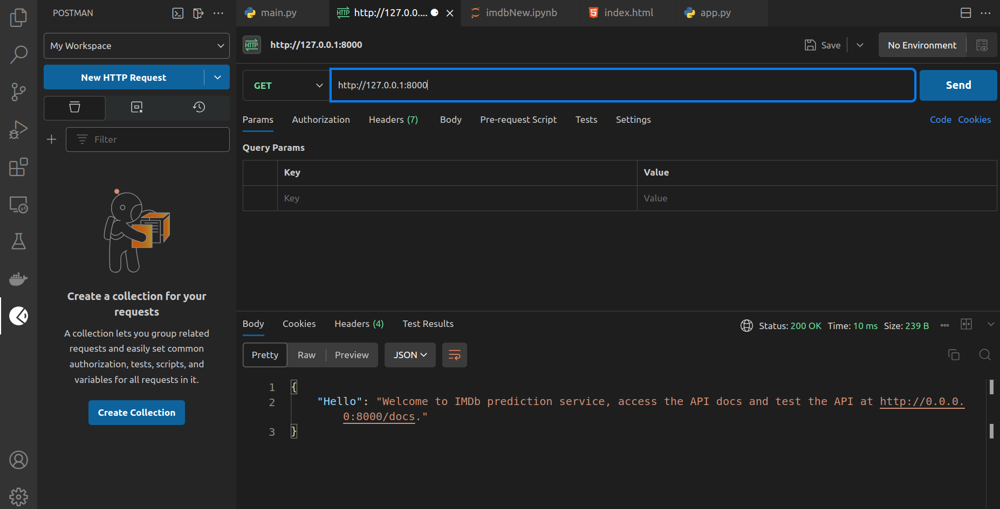
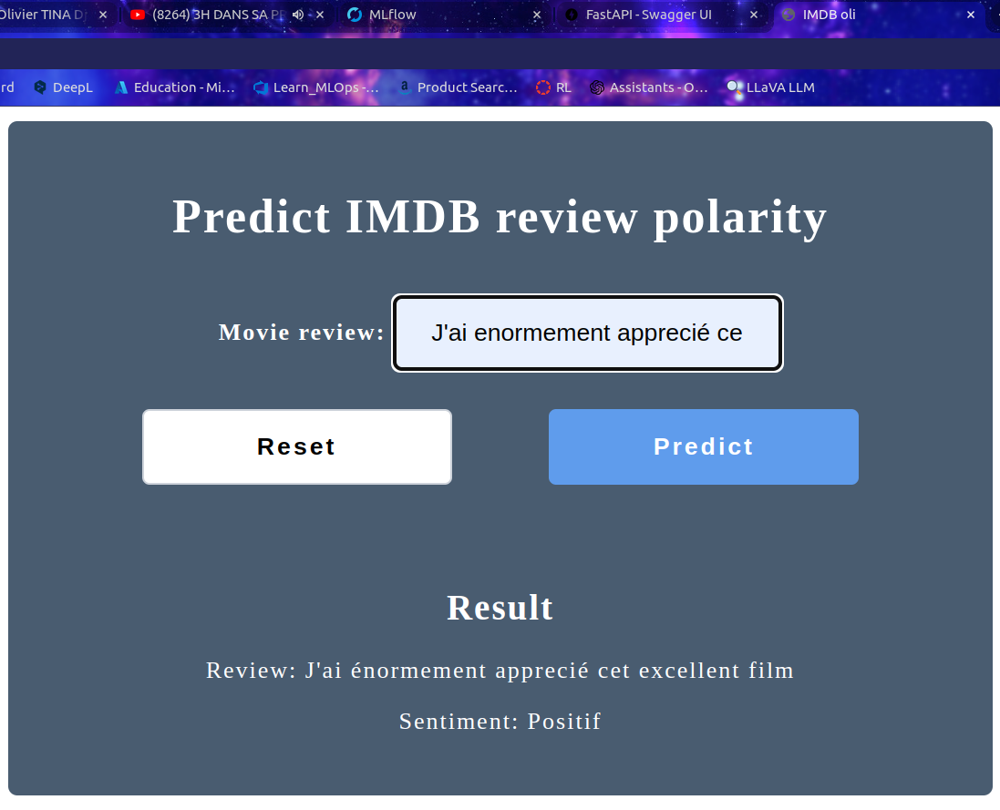
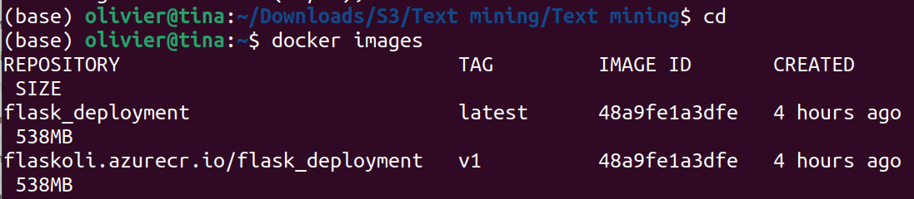
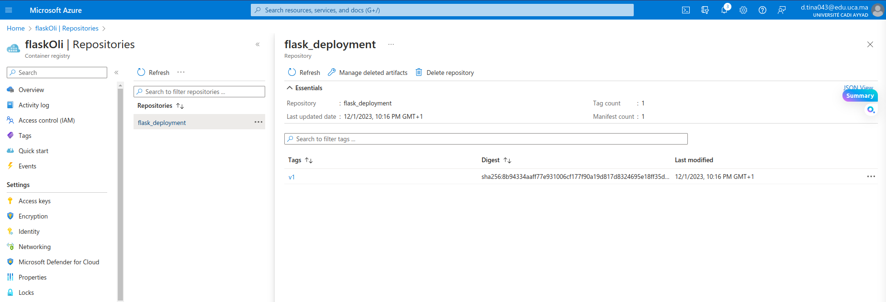
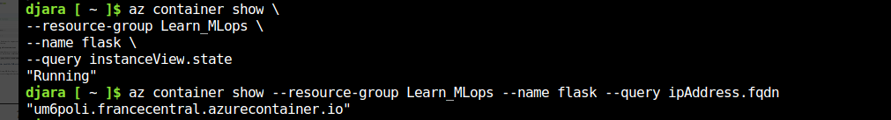

# IBDM Sentiment Analysis - MLOps Mid-Term Exam

Welcome to the Mid-Term Exam Repository for IBDM Review Sentiment Analysis! This repository encapsulates the source code and resources developed during our MLOps mid-term exam.

---

## 1. Model Development with MLflow

We kick-started our journey by preprocessing the data and training five distinct ML models. Visualize the process below:

Next, we delved into tracking model performance, versions, and parameters. The pinnacle was achieved by saving the best model in ONNX format and its dedicated preprocessing transformations using the transformers API, stored in pickle format.

---

## 2. FastAPI Integration

### Using Serialized Files
We seamlessly integrated the serialized files into our workflow:

### REST API Creation
Our journey continued by crafting a robust REST API for our model:

### Docker Containerization
The model was then packaged as a Docker container, enhancing scalability and deployment efficiency:

### Postman Testing
To ensure functionality, we rigorously tested and consumed our APIs using Postman:

---

## 3. Flask Application

### Dedicated Application
We developed a dedicated Flask application to seamlessly consume our API:

### Containerization with Docker
The application was packaged into a Docker container, streamlining deployment:

---

## 4. Bonus - Azure Container Instance Deployment

Our journey concluded with the deployment of the Docker container on Azure Container Instance:

---

## Acknowledgment

A heartfelt thank you to Professor Fahd Kalloubi for his invaluable explanations and guidance throughout the MLops course and labs. The success of this project is a testament to the knowledge imparted.

---
